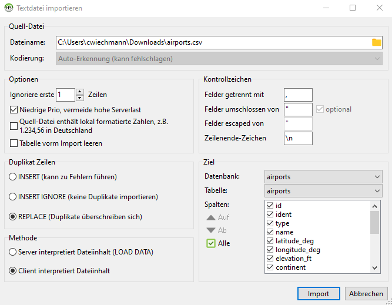

# Sample Airports Project/API
A sample project supposed to be replicated automatically using CI/CD into the Axway API-Management solution.

# Using ngrok
`ngrok http http://api-env.demo.axway.com:7070`


# Setup Test-MySQL DB
```
sudo vi /etc/my.cnf

Change bind-address to 0.0.0.0

sudo service mysqld restart

mysql -u root -p

CREATE DATABASE airports;

use airports;

CREATE TABLE IF NOT EXISTS `airports` (
  `id` int(11) NOT NULL,
  `ident` varchar(50) NOT NULL DEFAULT '',
  `type` varchar(50) NOT NULL DEFAULT '',
  `name` varchar(250) NOT NULL DEFAULT '',
  `latitude_deg` float NOT NULL DEFAULT '0',
  `longitude_deg` float NOT NULL DEFAULT '0',
  `elevation_ft` varchar(10) DEFAULT NULL,
  `continent` varchar(10) NOT NULL DEFAULT '0',
  `iso_country` varchar(10) NOT NULL DEFAULT '0',
  `iso_region` varchar(10) NOT NULL DEFAULT '0',
  `municipality` varchar(50) NOT NULL DEFAULT '0',
  `scheduled_service` varchar(10) NOT NULL DEFAULT '0',
  `gps_code` varchar(10) NOT NULL DEFAULT '0',
  `iata_code` varchar(10) NOT NULL DEFAULT '0',
  `local_code` varchar(10) NOT NULL DEFAULT '0',
  `home_link` varchar(250) DEFAULT '0',
  `wikipedia_link` varchar(250) DEFAULT '0',
  `keywords` varchar(500) DEFAULT '0'
) ENGINE=InnoDB DEFAULT CHARSET=latin1;

CREATE USER IF NOT EXISTS user IDENTIFIED BY  'password'

GRANT ALL ON airports.* TO 'user'@'%';
```

# Import the sample Airports data using for instance HeidiSQL



# Import the API into API-Manager
```
apim api import -c .\config\api-config.json -s api-env
```